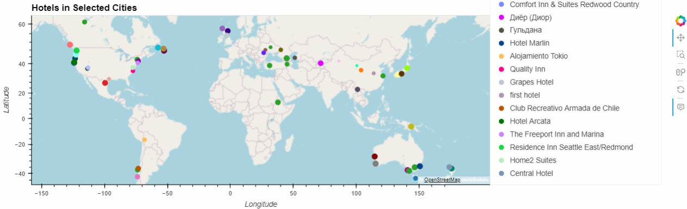

# Python_API_Challenge

## Description
practice using API weather data for vacation finder

## Table of Contents
- [Installation](#installation)
- [Usage](#usage)

- [Features](#features)
- [Tests](#tests)

## Installation
cartopy geoviews pyproj pandas hvplot.pandas requests citypy

## Usage
run jupyter notebook file to select weather attributes

## Features
scatter plots, correlations, maps, dataframes

## Tests
correlations

